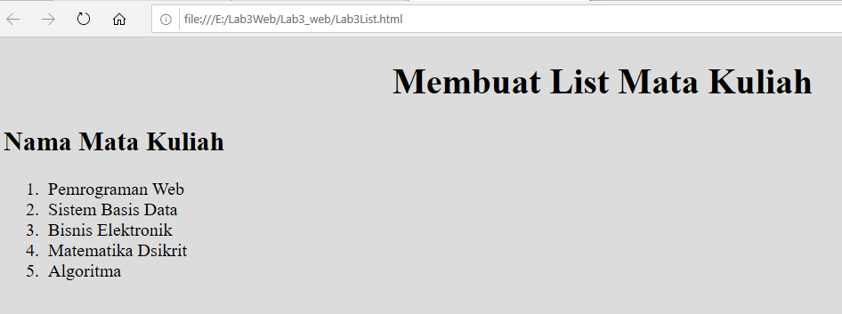
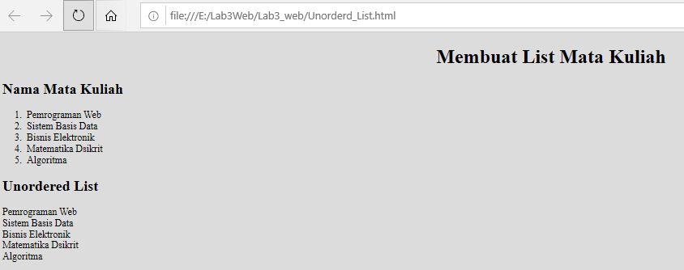
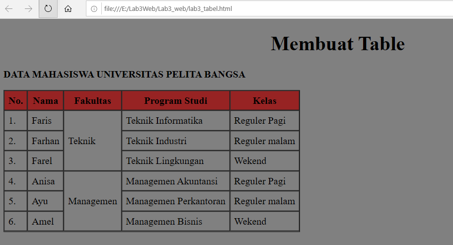

# Lab3_web

| Nama= Faris Syahluthfi      | 
|-----------------------------|
| NIM= 312010034              |
|=============================| 
| Kelas= TI.20.A.1            |
|-----------------------------|
| Matkul= Pemrograman Web     |
|=============================|

## 1. Membuat Ordered List


Ini adalah sebuah hasil dari texs Kodingan tag membuat Ordered List<p>
 Dan Ini Adalah program codingan dari tag Ordered List:

```html
<!DOCTYPE html>
<html lang="en">
<head>
<meta charset="UTF-8">
<meta name="viewport" content="width=device-width, initial-scale=1.0">
<title>HTML Lanjutan</title>
</head>
<body bgcolor="Gainsboro">
<header>
<h1><center>Membuat List Mata Kuliah</center></h1>

<section id="order-list">
    <h2>Nama Mata Kuliah</h2>
    <ol>
    <li>Pemrograman Web</li>
    <li>Sistem Basis Data</li>
    <li>Bisnis Elektronik</li>
    <li>Matematika Dsikrit</li>
    <li>Algoritma</li>
    </ol>
    </section>

</header>
</body>
</html>
```

## 2. Membuat Unorderd List


Ini adalah sebuah hasil dari texs Kodingan tag membuat Unorderd List<p>
 Dan Ini Adalah program codingan dari tag membuat Unorderd List:

 ```html

<!DOCTYPE html>
<html lang="en">
<head>
<meta charset="UTF-8">
<meta name="viewport" content="width=device-width, initial-scale=1.0">
<title>HTML Lanjutan</title>
</head>
<body bgcolor="Gainsboro">
<header>
<h1><center>Membuat List Mata Kuliah</center></h1>

<section id="order-list">
    <h2>Nama Mata Kuliah</h2>
    <ol>
    <li>Pemrograman Web</li>
    <li>Sistem Basis Data</li>
    <li>Bisnis Elektronik</li>
    <li>Matematika Dsikrit</li>
    <li>Algoritma</li>
    </ol>
    </section>

    <section id="unorder-list">
        <h2>Unordered List</h2>
        <li>Pemrograman Web</li>
    <li>Sistem Basis Data</li>
    <li>Bisnis Elektronik</li>
    <li>Matematika Dsikrit</li>
    <li>Algoritma</li>
        </ul>
        </section>

</header>
</body>
</html>
 ```


## 3. Membuat Tabel


Ini adalah sebuah hasil dari texs Kodingan tag membuat Tabel<p>
 Dan Ini Adalah program codingan dari tag membuat Tabel:

## Contoh Kode
```Html
<!DOCTYPE html>
<html lang="en">
<head>
<meta charset="UTF-8">
<meta name="viewport" content="width=device-width, initial-scale=1.0">
<title>HTML Lanjutan</title>
</head>
<body bgcolor="grey">
<header>
<h1><center>Membuat Table</center></h1>
</header>
<p><b>DATA MAHASISWA UNIVERSITAS PELITA BANGSA</b></p>

<table border="1" cellpadding="6" cellspacing="0">
    <thead>
    <tr style="background-color: rgb(151, 35, 35);">
    <th>No.</th>
    <th>Nama</th>
    <th>Fakultas</th>
    <th>Program Studi</th>
    <th>Kelas</th>
    </tr>
    </thead>
    <tbody>
    <tr>
    <td>1.</td>
    <td>Faris</td>
    <td rowspan="3">Teknik</td>
    <td>Teknik Informatika</td>
    <td>Reguler Pagi</td>
    </tr>

    <tr>
    <td>2.</td>
    <td>Farhan</td>
    <td>Teknik Industri</td>
    <td>Reguler malam</td>
    </tr>

    <tr>
    <td>3.</td>
    <td>Farel</td>
    <td>Teknik Lingkungan</td>
    <td>Wekend</td>
    </tr>

    <tr>
        <td>4.</td>
        <td>Anisa</td>
        <td rowspan="3">Managemen</td>
        <td>Managemen Akuntansi</td>
        <td>Reguler Pagi</td>
        </tr>
    
        <tr>
        <td>5.</td>
        <td>Ayu</td>
        <td>Managemen Perkantoran</td>
        <td>Reguler malam</td>
        </tr>
    
        <tr>
        <td>6.</td>
        <td>Amel</td>
        <td>Managemen Bisnis</td>
        <td>Wekend</td>
        </tr>


    </tbody>
    </table>

</body>
</html>
```

## 4. Menyisipkan Gambar


Ini adalah sebuah hasil dari texs Kodingan tag menyisipkan gambar<p>
 Dan Ini Adalah program codingan dari tag menyisipkan gambar:

 ```html

<!DOCTYPE html >
<HTMl>
    <head>
        <title>Menyisipkan gambar</title>
    <style>
body {

    color: red;
}
h1 {
	color: #ff00b3;
}
p {
	color: rgb(36, 85, 177)
}

    </style>
    </head>
    <body>

<!-- sub judul paragraf -->
<h1>Menambahkan Gambar</h1>
<!-- menambahkan gambar pada dokumen -->
<p>
    
 </p>

    </body>
    
</HTMl>

```

## 5. Menambahkan Hyperlink


Ini adalah sebuah hasil dari texs Kodingan tag menambahkan hyperlink<p>
 Dan Ini Adalah program codingan dari tag menambahkan hyperlink:

 ```html

<!DOCTYPE html >
<HTMl>
    <head>
        <title>Lab1Web__Faris</title>
    <style>
body {

    color: red;
}
h1 {
	color: #ff00b3;
}
p {
	color: rgb(36, 85, 177)
}

    </style>
    </head>
    <body>
	
	<!-- menambahkan link navigasi -->
<nav>
    <a href="file:///E:/Tugas%20Kuliah/Tugas%20kuliah%20semester%204/Membuat%20WEB/Membuat_Judul.html">Membuat judul</a>
    <a href="file:///E:/Tugas%20Kuliah/Tugas%20kuliah%20semester%204/Membuat%20WEB/Membuat_Paragraf.html">Membuat Paragraf</a>
    <a href="file:///E:/Tugas%20Kuliah/Tugas%20kuliah%20semester%204/Membuat%20WEB/Memformat_teks.html">Memformat teks</a>
    <a href="file:///E:/Tugas%20Kuliah/Tugas%20kuliah%20semester%204/Membuat%20WEB/Menyisipkan_Gambar.html">Meyisipkan gambar</a>
    <a href="file:///E:/Tugas%20Kuliah/Tugas%20kuliah%20semester%204/Membuat%20WEB/Lab1_Web.html">Halaman Web Eksternal Google</a>
    </nav>
    <hr>


    </body>
    
</HTMl>

```

## Full Program


Ini adalah sebuah hasil Program yang sudah saya buat<p>
 Dan Ini Adalah program codingannya:

 ```html

 <!DOCTYPE html >
<HTMl>
    <head>
        <title>Lab1Web__Faris</title>
    <style>
body {

    color: red;
}
h1 {
	color: #ff00b3;
}
p {
	color: rgb(36, 85, 177)
}

    </style>
    </head>
    <body>

        <marquee bgcolor="cyan" width="1500">WELCOME TO MY WEB FARIS SYAHLUTHFI</marquee>

    <!-- Ini adalah paragraf kesatu -->
    <h1><center>Biodata Faris Syahluthfi</center></h1>
        <p align=”justify,”>
            <br><b>Nama: Faris Syahluthfi</b></br>
            <br><b>Tempat: Jakarta</b></br>
            <br><b>Tanggal Lahir: 06 April 2002</b></br>
            <br><b>Alamat: Indramayu</b></br>
            <br> 
        </p>
        
    <!-- Ini adalah paragraf kedua -->
    <h2><center>My Profil</center></h2>

       
    <p align=left,”>
            <br><center><b>Assalamualaikum...</b></center></br>
            <br><b>Halo semuanya</b> perkenalkan nama saya <b>Faris Syahluthfi.</b>
            Saya Mahasiswa <b><u>Universitas Pelita bangsa</u></b> prodi <i><b>Teknik Informatika.</b></i> </br>
            <br>Alhamdulillah sekarang saya sudah kuliah <b><u>Semester 4</u></b> </br>
            <br>Sekarang saya sedang belajar tentang <b>HTML</b> yang diajarkan oleh dosen saya yang bernama <b><i>Bapak Agung Nugroho, S.Kom., M.Kom.</i></i></b>
            yang mengajar matakuliah <b><u>Pemrograman Web</u></b></p> <br>

        </p>

        <!-- sub judul paragraf -->
<h3>Menambahkan Gambar</h3>
<!-- menambahkan gambar pada dokumen -->
<p>
    
    </p>

<!-- menambahkan link navigasi -->
<nav>
    <a href="file:///E:/Tugas%20Kuliah/Tugas%20kuliah%20semester%204/Membuat%20WEB/Membuat_Judul.html">Membuat judul</a>
    <a href="file:///E:/Tugas%20Kuliah/Tugas%20kuliah%20semester%204/Membuat%20WEB/Membuat_Paragraf.html">Membuat Paragraf</a>
    <a href="file:///E:/Tugas%20Kuliah/Tugas%20kuliah%20semester%204/Membuat%20WEB/Memformat_teks.html">Memformat teks</a>
    <a href="file:///E:/Tugas%20Kuliah/Tugas%20kuliah%20semester%204/Membuat%20WEB/Menyisipkan_Gambar.html">Meyisipkan gambar</a>
    <a href="file:///E:/Tugas%20Kuliah/Tugas%20kuliah%20semester%204/Membuat%20WEB/Lab1_Web.html">Halaman Web Eksternal Google</a>
    </nav>
    <hr>


    </body>
    
</HTMl>

```